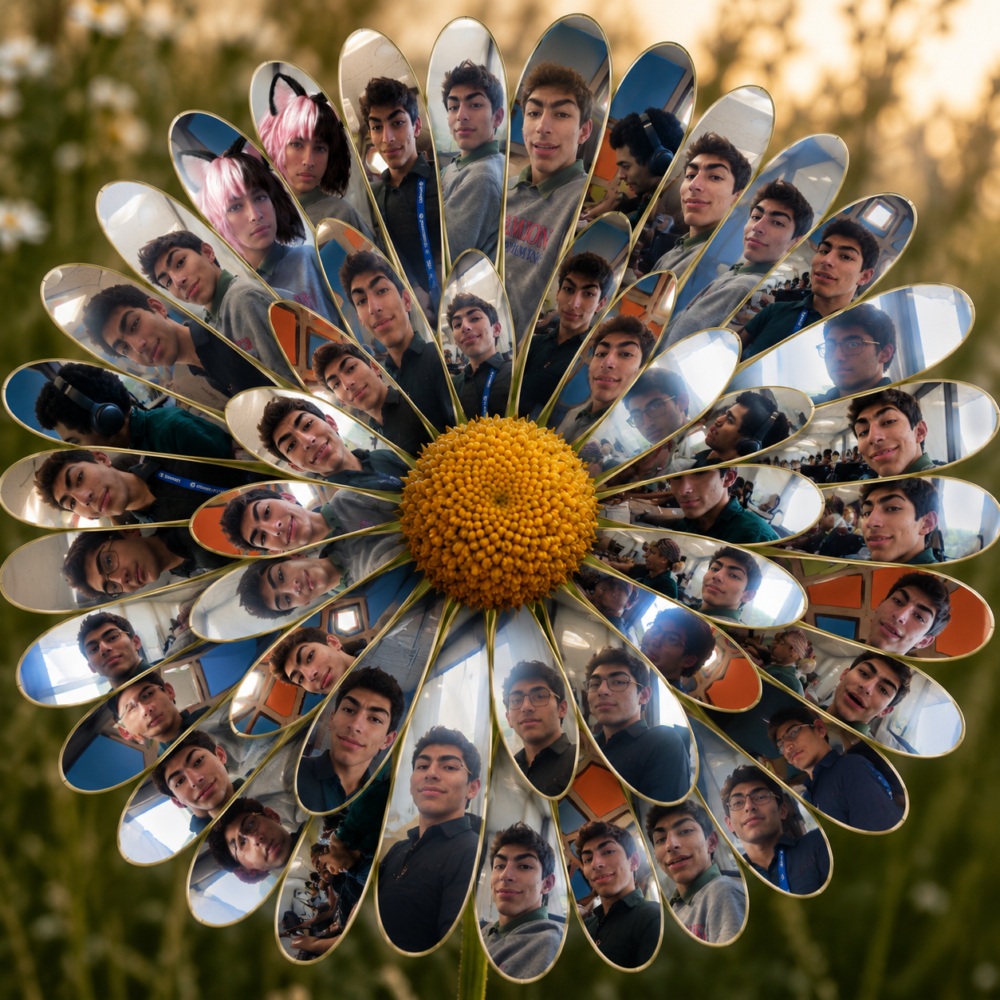

<!DOCTYPE html>
<html lang="en">
<head>
<meta charset="UTF-8">
<title>Rohen Clicker Site</title>

</head>
<body>

v1.2.0

Made with love by 🦐

<button class="stats-btn" id="statsBtn">Stats</button>

    
<b>All‑Time Rohens:</b> 0

    
<b>Manual Rohens:</b> 0

    
<b>Auto‑Rohens:</b> 0

    <button class="secret-trigger" id="secretTrigger" aria-hidden="true" tabindex="-1"></button>

    <h3>Secret Menu</h3>
    
You found it.

    <button class="secret-menu-close" id="giveMillionButton" style="margin-top:15px;">Give 1,000,000 Rohens</button>
    <button class="secret-menu-close" id="secretMenuClose">Close</button>

SKCUS NEHOR

    <h2>Rohen Clicker</h2>

    <button id="clickButton" class="spawn-btn">0</button>

    

        
More Rohens (+1/click)

        

            <button id="buyButton1xMore" class="upgrade-btn" disabled>
                
                1x — Cost: 25
            </button>

            <button id="buyButton10xMore" class="upgrade-btn" disabled>
                10x — Cost: 0
            </button>

            <button id="buyButtonMaxMore" class="upgrade-btn" disabled>
                Max (0) — Cost: 0
            </button>
        

    

    

        
Auto‑Rohen (+1/sec)

        

            <button id="buyButton1x" class="upgrade-btn" disabled>
                
                1x — Cost: 250
            </button>

            <button id="buyButton10x" class="upgrade-btn" disabled>
                10x — Cost: 0
            </button>

            <button id="buyButtonMax" class="upgrade-btn" disabled>
                Max (0) — Cost: 0
            </button>
        

    

    

        

            x0
            
        

        

            x0
            
        

    

</body>
</html>
